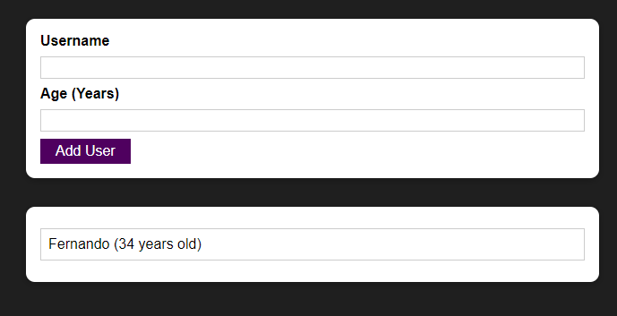

# react-practice-basic-form

Project developed as part of the **React - The Complete Guide** course, by Academind.

A basic form containing name and age inputs. 

## Topics covered

- Component creation
- Basic project structure
- Using JS functions within components
- Passing data between components (props)
- CSS Modules
- Managing states (with validation and resetting)
- Rendering lists of data
- Showing components conditionally